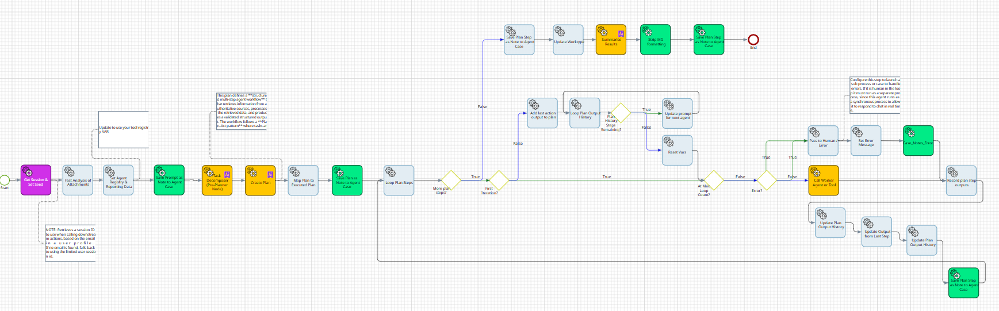
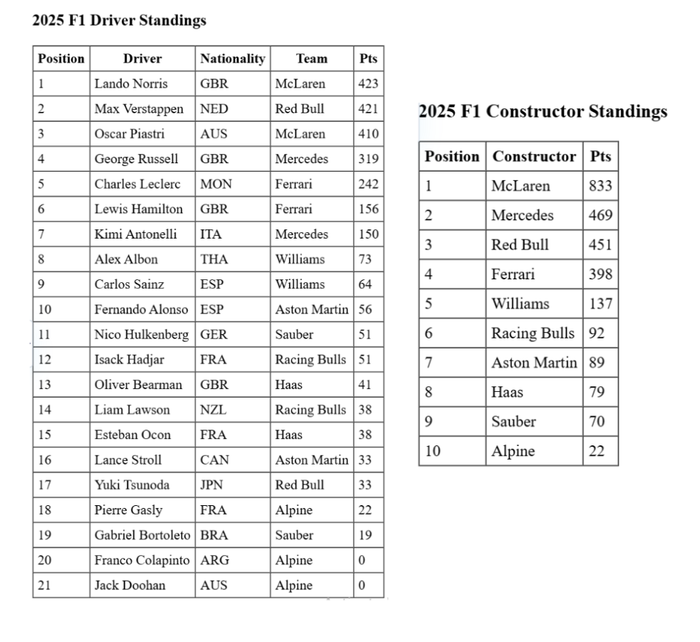

## Plan-Act Agent Pattern

### What Is It?


The **Plan-Act Agent** is an agentic AI design pattern that **separates planning from execution entirely**. Instead of diving directly into step-by-step reasoning and tool use (as reactive patterns like ReAct do), a Plan-Act agent first takes a step back and constructs a **complete, structured plan up front** — deciding all the necessary steps, what tools to call, and in what order — *before* any tools are executed  .

The planner (an LLM) produces a sequence of steps, each with:

- **Defined reasoning** — why this step is needed
- **A tool or worker agent** to call
- **Evidence variables** (`#E1`, `#E2`, `#E3`, …) — named placeholders that capture each step's output and can be referenced as inputs in later steps

Once the plan is generated, a **loop executor** carries out each step in order, resolving evidence variables as it goes. This is conceptually similar to how modern reasoning LLMs separate an internal "thinking" trace from the final output — planning and executing remain two distinct phases .

### Prerequisites

- **TotalAgility 2026.1+** — You need access to a TotalAgility 2026.1 (or later) environment to import and run the Plan-Act Agent package.
- **You.com Connector** *(recommended for the tutorial use case)* — Install the [TotalAgility connector for You.com](https://github.com/TungstenAutomationLabs/TotalAgility-connector-for-you.com-) to enable web search, deep research, and web content retrieval tools referenced in the tutorial below.

### Package Contents

The TotalAgility package includes the following components:

| Component | Type |
|---|---|
| **Agent Services** | Category |
| **Agentic Design Pattern Examples** | Category |
| Example - Async Agent | Process |
| Example - Sync Agent | Process |
| Tool Use - Micro Agent | Process |
| Example - Case Agent | Process |
| Agent Services | Custom service group |
| Get Session | Custom service |
| Service - Analyse Document - sync | Process |
| Service - Add Case Note | Custom service |
| Planning - Plan-Act Agent | Process |
| Agent Tool Registry | Global Variable |
| Agent Max Loop Count | Global Variable |
| TA Base URL | Web Service |
| AgentWorktype | Worktype |

> **Package note:** `MDcleaner.dll` is included in the package for markdown cleanup and formatting utilities. The `Strip MD formatting` `.NET` activity uses the `MDcleaner.Utils.StripMarkdownCodeBlock` method to remove markdown code block formatting.

> ⚠️ **After importing:** Update the **TA Base URL** web service to point to your TotalAgility environment, and review the **Agent Tool Registry** global variable to register the tools and worker agents available in your environment.

### How It Works



The agent follows this high-level flow:

```
User Prompt
    │
    ▼
┌──────────────────────┐
│  Get Session & Seed  │  ← Authenticate / reuse session
└──────────┬───────────┘
           ▼
┌───────────────────────────────┐
│  Fast Analysis of Attachments │  ← Optional: analyse any uploaded document
└──────────┬────────────────────┘
           ▼
┌──────────────────────────┐
│  Task Decomposer         │  ← Pre-planner: break complex prompts into
│  (Pre-Planner Node)      │    manageable sub-tasks
└──────────┬───────────────┘
           ▼
┌──────────────────────────┐
│  Create Plan (GenAI)     │  ← LLM generates a full Plan-Act plan:
│                          │    Steps, Tools, Evidence (E1→E2→…)
└──────────┬───────────────┘
           ▼
┌──────────────────────────┐
│  Loop Plan Steps         │  ← Iterate over each planned step
│  ┌────────────────────┐  │
│  │ Call Worker Agent  │  │  ← Dispatch to the tool/agent specified
│  │ or Tool (Sub-job)  │  │    in the plan step
│  ├────────────────────┤  │
│  │ Record plan step   │  │  ← Store output as evidence (#E1, #E2…)
│  │ outputs            │  │
│  ├────────────────────┤  │
│  │ Update Plan Output │  │  ← Feed evidence into subsequent steps
│  │ History            │  │
│  └────────────────────┘  │
└──────────┬───────────────┘
           ▼
┌──────────────────────────┐
│  Summarise Results       │  ← LLM synthesises all evidence into
│  (GenAI)                 │    a final response
└──────────┬───────────────┘
           ▼
       Final Output
```

**Key components**:

| Component | Role |
|---|---|
| **Task Decomposer** | Pre-planner GenAI node that breaks complex prompts into sub-tasks |
| **Create Plan** | GenAI node that produces the full Plan-Act plan with steps, tools, and evidence mapping |
| **Loop Plan Steps** | Iterates through each plan step sequentially |
| **Call Worker Agent or Tool** | Sub-job that dispatches to the appropriate tool/agent from the registry |
| **Evidence tracking** | Data list activities that record `#E1`, `#E2`, etc. and inject them into downstream steps |
| **Summarise Results** | GenAI node that synthesises all collected evidence into the final answer |
| **Error / Human-in-the-loop** | Max loop guard and error routing to a synchronization point for human escalation |

### When Should You Use It?

| Use Plan-Act When… | Use a Simpler Pattern (e.g., ReAct / Tool-Use) When… |
|---|---|
| The task requires **multiple coordinated steps** (research → extract → format) | A single tool call or direct LLM reply is sufficient |
| You need a **full audit trail** of reasoning and actions | Low-stakes, conversational Q&A |
| You want to **minimise LLM calls** (plan once, execute many) | The task is unpredictable and requires dynamic re-planning after each observation |
| **Deterministic, repeatable** workflows are important | Exploratory tasks where the next step depends entirely on the previous result |
| You're building **multi-agent orchestration** or composite "Russian Doll" agents | Simple single-agent scenarios |

---

### Tutorial: Getting Started with Plan-Act and You.com

This tutorial walks you through importing the Plan-Act Agent, installing the You.com connector for web search tools, configuring the tool registry, and running a test prompt to validate the full plan-act cycle.

#### Step 1 — Import the Plan-Act Agent Package

1. In TotalAgility Designer, navigate to **Advanced > Import Package**.
2. Select the Plan-Act Agent package file (`.pkg`) from this repository's `packages/` directory.
3. Follow the import wizard to completion, resolving any dependency prompts as needed.
4. Once imported, the Plan-Act Agent process and its supporting sub-processes will be available in your environment.

#### Step 2 — Install the You.com Connector

The [TotalAgility connector for You.com](https://github.com/TungstenAutomationLabs/TotalAgility-connector-for-you.com-) provides three tool agents that give the Plan-Act Agent web access capabilities:

| Tool Agent | Capability |
|---|---|
| **youcom_web_search** | Real-time web search via You.com Smart Search |
| **youcom_research** | Deep research synthesising multiple web sources |
| **youcom_get_web_content** | Full text extraction from a specific URL |

1. Download the You.com connector package from the [connector repository](https://github.com/TungstenAutomationLabs/TotalAgility-connector-for-you.com-).
2. Import the package into TotalAgility using **Advanced > Import Package**.
3. Configure your You.com API key as described in the connector's README.
4. Note the **Process IDs** assigned to each of the three You.com tool processes — you will need these in the next step.

#### Step 3 — Configure the Tool Registry

The Plan-Act agent dispatches work to tools and worker agents defined in an **Agent Tool Registry** JSON file. Update the `Set Agent Registry & Reporting Data` expression activity to include the You.com tools alongside the built-in `direct_reply` tool.

Below is a sample registry configuration with the You.com agents included:

```json
{
  "agents": [
    {
      "agent_name": "direct_reply",
      "description": "Use this when the request can be answered directly from the LLM's own knowledge without needing any external tools, searches, or data lookups. Suitable for general knowledge questions, explanations, creative writing, summarisation of provided text, or conversational replies.",
      "process_id": "",
      "intent": "direct_reply"
    },
    {
      "agent_name": "youcom_web_search",
      "description": "Performs a real-time web search using You.com Smart Search to find current information, news, facts, or references from across the internet. Returns a set of ranked search result snippets with source URLs. Use this when the user needs up-to-date information, wants to verify a claim, or needs to discover authoritative sources on a topic.",
      "process_id": "<YOUR_YOUCOM_SEARCH_PROCESS_ID>",
      "intent": "sync_agent"
    },
    {
      "agent_name": "youcom_research",
      "description": "Performs deep research using You.com Research mode. Synthesises information from multiple web sources into a comprehensive, cited research summary. Use this when the user needs an in-depth analysis, a literature review, a comparison of multiple perspectives, or a thorough investigation of a complex topic — not just a quick factual lookup.",
      "process_id": "<YOUR_YOUCOM_RESEARCH_PROCESS_ID>",
      "intent": "sync_agent"
    },
    {
      "agent_name": "youcom_get_web_content",
      "description": "Retrieves and extracts the full text content from a specific web page URL using You.com's web content retrieval service. Use this when a previous step has identified a specific URL and the full page content is needed for extraction, analysis, or summarisation. Requires a URL as input.",
      "process_id": "<YOUR_YOUCOM_WEBCONTENT_PROCESS_ID>",
      "intent": "sync_agent"
    },
    {
      "agent_name": "document_analyser",
      "description": "Analyses an uploaded document (PDF, image, etc.) to extract its content, metadata, and structure. Use this when the user has attached a file and the task requires understanding or extracting information from that document.",
      "process_id": "<YOUR_DOC_ANALYSIS_PROCESS_ID>",
      "intent": "sync_agent"
    }
  ]
}
```

> **Note:** Replace the `<YOUR_..._PROCESS_ID>` placeholders with the actual TotalAgility process IDs from your imported You.com connector package.

#### Step 4 — Test the Agent

Use the following prompt to test the Plan-Act agent with the You.com tools registered above. This prompt exercises the full plan-act cycle: web search → source evaluation → content retrieval → data extraction → structured output.

> **Prompt:**
>
> *"Research the top 5 large language models released in 2025–2026 by market adoption. For each model, find the developer, release date, parameter count (if public), and primary use case. Use web search to discover the models, retrieve the content from the most authoritative source for each, and compile the results into a structured markdown table. Cite your sources."*

**Expected Plan-Act behaviour:**

1. **Step 1 — Web Search** (`youcom_web_search`): Search for "top large language models 2025 2026 by market adoption" → Evidence `#E1` (list of search results with URLs)
2. **Step 2 — Source Evaluation** (`direct_reply`): Evaluate `#E1` and select the 3–5 most authoritative URLs → Evidence `#E2` (selected URLs)
3. **Step 3 — Content Retrieval** (`youcom_get_web_content`): Retrieve full page content from each URL in `#E2` → Evidence `#E3` (raw page content)
4. **Step 4 — Data Extraction** (`direct_reply`): Extract model name, developer, release date, parameter count, and use case from `#E3` → Evidence `#E4` (structured data)
5. **Step 5 — Format Output** (`direct_reply`): Compile `#E4` into a markdown table with source citations → Final output

---

### Integration Options

The Plan-Act Agent can be invoked in multiple ways:

| Method | Description |
|---|---|
| **Generative AI Chat Control** | Map the process to a "Custom LLM" configuration under *Integration > Generative AI* and use it from a TotalAgility Form |
| **Microsoft Teams** | Call via a Tool-Use or Router "Chat Agent" exposed through the [TotalAgility MS Teams Agent](https://github.com/TungstenAutomationLabs/TotalAgility-MSTeams-Agent) sample, enabling end users to interact with the Plan-Act Agent directly from Teams |
| **OpenAPI REST Interface** | Call via TotalAgility's REST API for programmatic integration with external applications |
| **MCP (Model Context Protocol)** | Expose via the example MCP Proxy Server for TotalAgility |
| **Multi-Agent Composition** | Call from other TotalAgility Agents, Cases, or Processes to create "Russian Doll" style composite agent workflows |

### Key Configuration Notes

- **Tool Registry**: Update the `Set Agent Registry & Reporting Data` expression activity to point to your registry variable/file.
- **Max Loop Count**: The `At Max Loop Count?` decision node prevents runaway execution. If the loop limit is reached, the case is routed to the `Pass to Human / Error` synchronization point for human escalation.
- **Session Management**: The `Get Session & Set Seed` activity retrieves or creates a user session based on their email profile, propagating identity to all downstream agent/tool calls.
- **Error Handling**: Configure the `Pass to Human / Error` synchronization step to launch a sub-process or case for human-in-the-loop review. This must run as a separate process since the agent runs synchronously to support real-time chat responses.
- **Document Support**: If a document is attached, the `Fast Analysis of Attachments` sub-job analyses it before planning begins, making document content available to the planner and all subsequent steps.

### 🏗️ How Plan-Act Works: Three Roles

At the heart of the Plan-Act Framework are three distinct roles:

| Role | Responsibility |
|---|---|
| **Planner** | Constructs a complete, multi-step plan in a **single reasoning pass**. Specifies the ordered sequence of actions, the tools required, and the **evidence variables** (`#E1`, `#E2`, …) that connect steps — where the output of one action becomes the input to another. Crucially, this operates over *expected structure*, not observed data. |
| **Worker** | An **executor, not a thinker**. Receives the plan and carries out each action exactly as specified — invoking tools, collecting results, and respecting variable dependencies. The Worker does not reinterpret goals, revise steps, or request additional reasoning. |
| **Solver** | Consumes the outputs produced during execution and **synthesizes them into a final response**. This phase may involve a final reasoning step, but it is strictly downstream of execution. The Solver does not influence which tools were used or how they were sequenced. |

Together, these roles enforce a clean separation: **reasoning happens before acting, and interpretation happens after.**

### ⚡ Why Plan-Act Over Plan-Act-Reflect-Repeat Patterns?

The Plan-Act Framework reframes agentic intelligence as something that can be exercised **economically**. Instead of continuous deliberation, intelligence is concentrated in a single, high-leverage planning act.

| | **Plan-Act-Reflect-Repeat** | **Plan-Act (This Pattern)** |
|---|---|---|
| **Approach** | Interleaves thinking → acting → observing, one step at a time | Generates the full plan first, then executes all steps |
| **Reasoning style** | Reasoning **with** observation — must wait for each tool result before deciding the next step | Reasoning **without** observation — plans the entire sequence upfront without waiting for tool outputs |
| **LLM calls** | One per step (can be many) | One for planning + deterministic execution |
| **Token efficiency** | High redundancy — repeats prompts and observations at every stage | Lean — on HotpotQA benchmarks, reduced tokens from ~9,800 to under 2,000 |
| **Cost** | ~$20 per 1,000 runs (HotpotQA) | ~$4 per 1,000 runs (HotpotQA) — an **80% reduction** |
| **Accuracy** | 40.8% (HotpotQA) | 42.4% (HotpotQA) — **slightly better while being far cheaper** |
| **Best for** | Dynamic, unpredictable environments requiring real-time adaptation | Semi-deterministic tasks with predictable steps and well-defined tool contracts |

> *Source for benchmarks: [arXiv:2305.18323](https://arxiv.org/abs/2305.18323)*

### Other Example: 2025 F1 Standings → HTML Report

To make the pattern concrete, here's a real end-to-end walkthrough. The task given to the agent:

> *"In the 2025 F1 competition, find the rankings for the constructor and driver results, and write this as an HTML table."*

#### 📋 Planning Phase (Plan)

The Planner broke the high-level task into a structured sequence of 7 steps — **all planned upfront in a single LLM call** before any tool was executed:

| Step | Action | Tool / Agent | Evidence Variable | Dependencies |
|---|---|---|---|---|
| 1 | Search for authoritative sources (Formula1.com, FIA, Wikipedia) for both driver and constructor standings | `Service - Web Search` | `#E1` | — |
| 2 | From search results, select the single most reliable URL for drivers and constructors | `Select Authoritative Standings URLs` | `#E2` | ← `#E1` |
| 3 | Fetch the full raw HTML from the driver standings URL | `Bot - Get Webpage HTML` | `#E3` | ← `#E2` |
| 4 | Fetch the full raw HTML from the constructor standings URL | `Bot - Get Webpage HTML` | `#E4` | ← `#E2` |
| 5 | Parse both HTML pages into structured JSON (position, name, team, points, nationality) | `Extract Standings to Structured JSON` | `#E5` | ← `#E3`, `#E4` |
| 6 | Generate a single HTML document with two tables (drivers + constructors) and compilation date | `Generate HTML and Prepare Save Payload` | `#E6` | ← `#E5` |
| 7 | Save the HTML file to storage and return confirmation | `Service - Save Text to Named File` | `#E7` | ← `#E6` |

The framework explicitly planned every micro-action while maintaining dependencies between steps, ensuring each step had the required evidence from previous steps.

#### ⚙️ Execution Phase (Act)

Each micro-agent carried out its designated task in sequence — no re-reasoning, no redundant LLM calls:

| Agent | What It Did |
|---|---|
| **Search Agent** | Retrieved authoritative pages for F1 2025 standings |
| **Selection Agent** | Picked the most credible URLs (Formula1.com preferred) |
| **Fetch Agents** (×2) | Downloaded raw HTML content for driver and constructor pages |
| **Parsing Agent** | Converted raw HTML into structured JSON with all requested fields |
| **HTML Generation Agent** | Created a formatted HTML document with two tables |
| **Storage Agent** | Saved the final HTML file and confirmed completion |

The Worker simply followed the plan. Intermediate outputs (search results → URLs → HTML → JSON → final HTML) flowed through the evidence variable chain exactly as the Planner specified.

#### 📊 Output

**Compiled HTML rendered in browser:**




The final output: a valid HTML document containing two fully formatted tables:

- **2025 F1 Driver Standings** — 21 drivers with Position, Driver, Nationality, Team, and Points
- **2025 F1 Constructor Standings** — 10 constructors with Position, Constructor, and Points

#### 🔑 Key Observations

| Observation | Detail |
|---|---|
| **Orchestrated dependency chain** | The Plan-Act pattern dynamically coordinated multiple micro-agents based on the dependency graph: `#E1` → `#E2` → `#E3`/`#E4` → `#E5` → `#E6` → `#E7` |
| **Minimized cost & latency** | Only essential web pages were fetched and parsed. No unnecessary repeated reasoning or redundant web requests occurred. |
| **Human-readable output** | Raw HTML from the web was transformed into clean, structured tables with all requested fields. |
| **Single planning call** | The entire 7-step plan was generated in one LLM invocation. Execution was purely mechanical. |

### 💡 Why Reasoning *Without* Observation?

You might be wondering: why does Plan-Act reason **without** waiting for observations, rather than the traditional approach of reasoning **with** observations?

| | **Reasoning With Observation** (ReAct) | **Reasoning Without Observation** (Plan-Act) |
|---|---|---|
| **How it works** | The LLM generates a thought → executes a tool → **waits** for the observation → feeds it back into the prompt → decides the next step | The **Planner** generates a complete blueprint of all steps upfront → the **Worker** executes them independently → the **Solver** synthesizes the final answer |
| **Flow** | Stop-and-go loop: Think → Act → Observe → Think → Act → Observe → … | Single pass: Plan (once) → Execute (all steps) → Solve |
| **Redundancy** | High — context and examples are repeated at every step, observations (e.g., Wikipedia snippets) bloat the prompt | Low — each step is lean, no repeated context |
| **When it shines** | When the next step truly depends on discovering something unknown | When the task structure is predictable and tool contracts are well-defined |

In the F1 example above, pausing after each step to "rethink" would add no value — the compliance rules, data sources, and output format were all known upfront. Plan-Act leveraged that stability by **planning once and executing efficiently**.

### 🧭 When to Use Plan-Act vs. Reactive Patterns

Plan-Act does **not** aim to replace interactive reasoning patterns — it **complements** them.

| Use Plan-Act when… | Use ReAct / Reactive when… |
|---|---|
| The required steps are predictable | The environment is dynamic and unpredictable |
| Tools have well-defined contracts | Discovery and exploration are needed |
| Execution cost dominates reasoning cost | Real-time adaptation is critical |
| You need auditability and traceability | The task structure is unknown upfront |
| You want to minimize token usage and cost | Flexibility matters more than efficiency |

> **The bottom line:** Effective agentic AI requires a balance between adaptability and foresight. Agents must know when to plan ahead and when to act on-the-fly. Where structure and predictability prevail, Plan-Act demonstrates that thoughtful upfront planning can be both sufficient and superior.

### 📖 Learn More

For a comprehensive deep dive into the agentic AI planning pattern, including neuroscience parallels, detailed benchmarks, and implementation walkthroughs:

👉 **[The Agentic AI Planning Pattern — Tungsten Automation](https://www.tungstenautomation.com/learn/blog/the-agentic-ai-planning-pattern)**


### Additional Resources

For more agentic design patterns and reference implementations for TotalAgility, see the **Agentic Design Patterns for TotalAgility** repository:

🔗 **[Agentic Design Patterns for TotalAgility](https://github.com/TungstenAutomationLabs/Agentic_Design_Patterns_For_TotalAgility)**

This companion repository provides a catalogue of reusable agent design patterns built on TotalAgility, including:

- **Pattern overviews** — Descriptions and rationale for each agentic pattern (e.g., Tool-Use, ReAct, Plan-Act, Reflection, Multi-Agent Orchestration).
- **Reference implementations** — Importable TotalAgility packages demonstrating each pattern.
- **Prompt templates** — Reusable system and planner prompts tailored to each pattern.
- **Data models** — JSON schemas for tool registries, plan structures, and evidence tracking.
- **Integration examples** — Samples for connecting agents via REST APIs, MCP, Generative AI Chat Controls, and multi-agent composition.

Use it as a starting point for exploring which agentic patterns best fit your automation use cases, and as a library of building blocks for constructing your own TotalAgility agent workflows.

---
